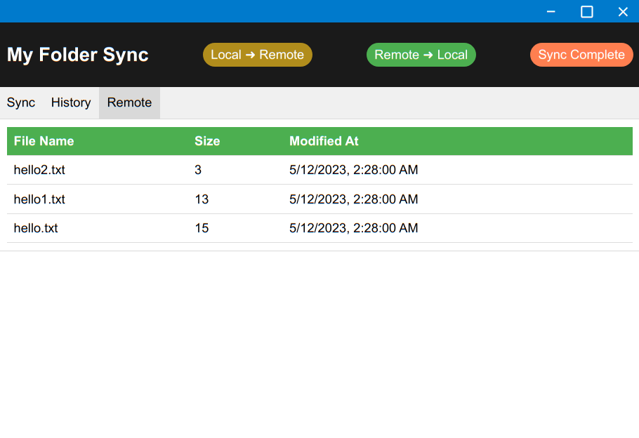

# FTP data synchronization application written in Electron


## Installation and Use

To clone and run this repository you'll need [Git](https://git-scm.com) and [Node.js](https://nodejs.org/en/download/) (which comes with [npm](http://npmjs.com)) installed on your computer. From your command line:

Clone the repo and install npm
```bash
# Clone this repository
https://github.com/khanghy3004/node-watch-folder
# Go into the repository
cd node-watch-folder
# Install dependencies
npm install
# Run the app
npm start
```
